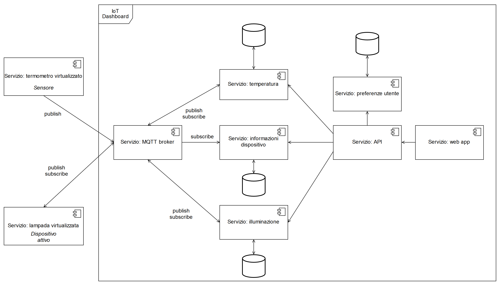
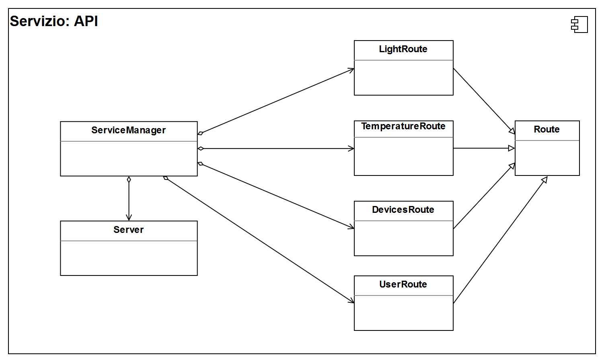

[_Torna al documento indice/Back_](./README.md)

# Specifica Tecnica

## Introduzione

### Scopo del documento

Lo scopo di questo documento è quello di definire la progettazione dell'architettura ad alto livello del progetto di stage.
Il presente, tra le altre cose, tratta di:

-   tecnologie utilizzate;
-   architettura del sistema e dei relativi componenti software;
-   Design Pattern[1](#1) impiegati per la progettazione.

### Scopo del progetto

Lo stage prevede lo sviluppo e la realizzazione di una dashboard per la gestione di dispositivi interconnessi (IoT). L'idea alla base del sistema è quella di un centro di controllo attraverso cui l'utente del sistema gestisca i dispositivi smart presenti nella propria rete domestica.

## Tecnologie utilizzate

In questa sezione sono descritte le tecnologie che verranno utilizzate per lo sviluppo del progetto, includendo la motivazione che ha portato lo studente a sceglierle.
Gli strumenti di sviluppo che verranno impiegati sono inclusi in questa sezione.

| Tecnologia         | Sommario                                                                                                                                    |
| ------------------ | ------------------------------------------------------------------------------------------------------------------------------------------- |
| Node.js            | Node.js è un'ambiente d'esecuzione utilizzato per l'implementazione di applicazioni server in JavaScript.                                   |
| React              | React è una libreria per il linguaggio JavaScript il cui scopo è costruire interfacce utente.                                               |
| EcmaScript 2017    | EcmaScript è un linguaggio di programmazione la cui implementazione standard più conosciuta è JavaScript.                                   |
| Jest               | Jest è un framework per l'implementazione di test per codice JavaScript.                                                                    |
| ESLint             | ESLint è uno strumento open-source per l'analisi statica del codice JavaScript prodotto.                                                    |
| HTML5              | HTML5 è un linguaggio di markup per la formattazione e impaginazione delle pagine Web pubblicato come W3C Recommendation dall'ottobre 2014. |
| CSS3               | CSS3 è un linguaggio di formattazione delle pagine Web.                                                                                     |
| Atom               | Atom è un editor di testo sviluppato da GitHub con tecnologie moderne e personalizzabile.                                                   |
| Visual Studio Code | Visual Studio Code è un editor di testo sviluppato da Microsoft specificatamente per i linguaggi del Web.                                   |

### Node.js

Node.js è un'ambiente d'esecuzione per JavaScript multipiattaforma e open-source utilizzato per l'implementazione di applicazioni server in JavaScript.

Per consentire l'esecuzione di JavaScript lato server, Node utilizza il motore di esecuzione JavaScript **V8** sviluppato da Google per il browser Chrome.

-   Aspetti positivi:
    -   Node utilizza il modello _event-driven_ per la gestione delle operazioni di _input_ e _output_ (I/O) e in questo modo semplifica la gestione asincrona delle richieste concorrenti.
    -   Node utilizza JavaScript, un linguaggio di programmazione dalla sintassi semplice da imparare.
    -   Node utilizza npm per la gestione delle librerie dell'applicazione, il quale è il più grande registro di componenti di codice riusabile.
-   Aspetti negativi:
    -   Node non sfrutta i molti core presenti nelle CPU moderne e quindi operazioni fortemente CPU-bound congelano l'intero ciclo di eventi fino al termine dell'esecuzione dell'operazione.
    -   Node favorisce l'utilizzo del Design Pattern "_callback_", tuttavia in funzioni complesse si potrebbe incorrere in una eccessiva complessità nella lettura del codice.

### React

React è una libreria per il linguaggio JavaScript il cui scopo è costruire interfacce utente.

-   Aspetti positivi:
    -   React utilizza un DOM virtuale per disegnare le interfacce, raggiungendo performance ed efficienza elevate. Grazie alla sua struttura a componenti, un aggiornamento ad uno di essi non richiede l'aggiornamento degli altri.
    -   I componenti sviluppati possono essere riutilizzati, garantendo un aumento di produttività degli sviluppatori.
    -   I dati in React seguono un flusso unidirezionale, in cui i componenti figli non possono modificare dati dei loro genitori, semplificando la manutenzione dei componenti.
-   Aspetti negativi:
    -   Data la natura molto dinamica di React, gli sviluppatori devono mantenersi aggiornati per tutte le nuove funzionalità inserite.

### EcmaScript 2017

ECMAScript 2017 è un linguaggio di programmazione standardizzato la cui ratifica è avvenuta nel giugno del 2017. L'implementazione dello standard più conosciuta è JavaScript.

L'edizione 2017 dello standard porta in dote le seguenti funzionalità:

1.  Nuova sintassi per le **funzioni asincrone**. La keyword `async` indica che una funzione o un metodo ritornano una Promise, ossia una classe di oggetti che evidenziano l'asincronia dell'operazione da eseguire. La keyword `await` aspetta che la funzione asincrona termini la sua esecuzione, ritornando il risultato della Promise.
2.  Supporto iniziale per l'elaborazione multithread, attraverso tipi di oggetti immutabili e condivisibili tra thread.
3.  Nuovi metodi per gli oggetti esistenti nel linguaggio (enumerazione dei membri di un oggetto e ulteriori funzionalità di manipolazione di stringhe).

-   Aspetti positivi:
    -   La nuova sintassi per la scrittura di funzioni asincrone è molto facilmente leggibile in quanto ricorda una programmazione sequenziale.
    -   Il supporto per l'elaborazione multithread consente a chi ha necessità e competenza di poter sfruttare le architetture a molti core delle moderne CPU, favorendo l'utilizzo di JavaScript anche per la programmazione di codice parallelo per le GPU.
    -   Poche nuove funzionalità rispetto alle edizioni precedenti permettono di imparare le nuove con maggior semplicità.
-   Aspetti negativi:
    -   Con la nuova sintassi per le funzioni asincrone è molto facile dimenticarsi della natura asincrona del codice scritto, omettendo quindi la keyword `await`.
    -   Il supporto alla nuova edizione dello standard è presente in maniera completa solamente nelle ultime versioni dei browser e di Node.js.[fonti](#fonte)

### Jest

Jest è un framework per l'implementazione di test per codice JavaScript scritto da Facebook.

-   Aspetti positivi:
    -   Jest non richiede una configurazione, utilizzando impostazioni predefinite ottimali.
    -   Jest è una piattaforma di test completa che include strumenti di validazione dei risultati e  strumenti per il mocking.
    -   Jest comprende funzionalità per i test di regressione dei componenti scritti in React.
    -   Jest per default esegue i test parallelamente, velocizzando i processi di test.
-   Aspetti negativi:
    -   Jest è meno flessibile nel suo utilizzo rispetto ad altre librerie di test, quali ad esempio Mocha.

### ESLint

ESLint è uno strumento che esegue analisi del codice sorgente scritto in JavaScript alla ricerca di bug noti, di inconsistenze di stile nella scrittura del codice e mira a mantenere il codice facilmente leggibile e manutenibile.

-   Aspetti positivi:
    -   ESLint è altamente configurabile, permettendo la definizione di regole condivise più appropriate per il proprio progetto.
    -   Supporta numerose tecnologie per mezzo di plugin ed è supportato da molti strumenti di sviluppo.
    -   Le regole di analisi sono ben documentate, con esempi sul loro utilizzo, e gli errori emessi sono ben leggibili.
-   Aspetti negativi:
    -   ESLint richiede una configurazione iniziale per iniziare a utilizzarlo.

### HTML5 & CSS3

HTML5 e CSS3 sono le ultime revisioni stabili rispettivamente del linguaggio HTML e del linguaggio CSS rilasciate dalla W3C.

-   Aspetti positivi:
    -   HTML5 ha il vantaggio di utilizzare una sintassi semplificata e più chiara rispetto alle versioni precedenti dello standard e permette l’integrazione con diversi formati multimediali senza utilizzare plugin esterni.
    -   HTML5 e CSS3 sono ben diffusi e tutti i browser più recenti li supportano anche in caso di versioni non aggiornate.
    -   HTML5 e CSS3 sono ben documentati e sono disponibili nella rete numerose risorse per il loro utilizzo ottimale.
-   Aspetti negativi: Nessuno.

### Atom

Atom è un editor di testo sviluppato da GitHub che può essere utilizzaato come un IDE (Integrated Development Environment).

-   Aspetti positivi:
    -   Atom è estremamente espandibile e personalizzabile, permettendo di creare un ambiente di sviluppo su misura.
    -   Atom riconosce la sintassi di moltissimi linguaggi attraverso moduli installabili.
-   Aspetti negativi:
    -   Atom richiede un utilizzo della CPU elevato che ne mina la stabilità generale.
    -   Atom non si interfaccia nativamente con strumenti di debug del codice.

### Visual Studio Code

Visual Studio Code è un editor di testo sviluppato da Microsoft per la scrittura di applicazioni Web.

-   Aspetti positivi:
    -   É molto efficiente nell'utilizzo di risorse, risultando uno strumento affidabile.
    -   É dotato di supporto nativo per strumenti di debug
-   Aspetti negativi:
    -   Non è molto personalizzabile e l'interfaccia predefinita è molto scarna.

## Architettura

L'architettura scelta per il sistema segue lo stile architetturale a microservizi con l'obiettivi di approfondire questo stile architetturale e implementarlo in uno scenario plausibile.
Lo stile architetturale a microservizi descrive un metodo di progettazione delle applicazioni come **insiemi di servizi eseguibili indipendentemente**, **che comunicano tra loro grazie a meccanismi di comunicazione leggeri**.

### Servizio: MQTT Broker

Il broker MQTT è il servizio resonsabile alla ricezione di tutti i messaggi, alla loro catalogazione e all'invio delle notifiche verso i client sottoscritti a ciascuna categoria.
Il broker memorizza lo stato di tutti i client a lui connessi, inclusi i messaggi non ancora inviati o il cui invio è fallito.

### Servizio: termometro _virtualizzato_

Questo servizio simula la presenza di un sensore che invii dati sulla temperatura dell'ambiente in cui si trova.

Esso pubblica periodicamente la temperatura rilevata secondo l'argomento `temperature` e secondo l'argomento `hw_info` i propri dati identificativi, quali produttore, modello, ecc.

Data la relativa importanza i dati vengono inviati con un QoS di livello 0 nella categoria `temperature`, mentre con QoS di livello 1 nella categoria `hw_info`.

Anche se nel diagramma è disegnato individualmente, è possibile che ve ne siano molteplici.

#### Servizio: termometro _virtualizzato_ - Panoramica delle classi

Classe                        | Funzionalità
------------------------------|-------------------------------------------------------------------------------------------------------------------------------------------------------------------------------------------------
`DeviceInfo`                  | Classe i cui oggetti rappresentano le informazioni del dispositivo, quali produttore, modello, revisione, ecc. Questi dati vengono pubblicati nel topic `hw_info`.
`ServiceManager`              | Classe responsabile dell'integrazione tra generazione dei dati di temperatura, gestione delle informazioni del dispositivo e invio delle informazioni tramite protocollo MQTT.
`MQTTClient`                  | Classe utile all'inizializzazione del client MQTT.
`TemperatureCurveFactory`     | Classe Factory astratta che espone la funzionalità di creazione della curva di temperatura, rappresentata dalla classe `TemperatureCurve`.
`SineTemperatureCurveFactory` | Implementazione della factory `TemperatureCurveFactory` per la creazione di oggetti `SineTemperatureCurve`.
`TemperatureCurve`            | Classe astratta che espone le funzionalità di inizializzazione della funzione, di aggiunta di rumore pseudocasuale nella funzione creata e di simulazione della temperatura data l'ora corrente.
`SineTemperatureCurve`        | Classe che implementa `TemperatureCurve` definendo una funzione di simulazione sinusoidale, in cui i parametri modificabili sono ampiezza, frequenza e fase.

### Servizio: temperatura

Questo servizio si occupa di raccogliere tutti i dati provenienti dai sensori di temperatura, memorizzandoli e mettendoli a disposizione in un formato strutturato per gli altri servizi del sistema.

Il servizio si sottoscrive alla categoria `temperature` e comunica con un QoS di livello 0, inoltre può pubblicare messaggi con la sottocategoria `temperature/active` per usufruire delle funzionalità aggiuntive presenti in dispositivi attivi legati alla temperatura.

#### Servizio: temperatura - Panoramica delle classi

Classe            | Funzionalità
------------------|--------------------------------------------------------------------------------------------------------------------------------------------------------------------------
`ServiceManager`  | Classe responsabile dell'integrazione tra ricezione dei dati di temperatura, gestione della persistenza dei dati ed esposizione di una interfaccia per gli altri servizi.
`MQTTClient`      | Classe utile all'inizializzazione del client MQTT.
`DBClient`        | Classe utile all'inizializzazione del client per il database del servizio.
`API`             | Classe che rappresenta le funzionalità esposte all'esterno dal servizio.
`TemperatureData` | Classe che rappresenta i dati ricevuti dai dispositivi attraverso il protocollo MQTT.

### Servizio: lampada _virtualizzata_

Questo servizio simula la presenza di un dispositivo _attivo_: una lampada in grado di comunicare il proprio assorbimento energetico e la sua durata stimata.
La lista delle operazioni disponibili è la seguente:

1.  accensione della lampada (QoS di livello 1);
2.  spegnimento della lampada (QoS di livello 1);
3.  richiesta assorbimento energetico (QoS di livello 0);
4.  richiesta tempo di vita stimato della lampada (QoS di livello 0).

L'argomento a cui la lampada si sottoscrive è `light/active`, in quanto capace di rispondere a richieste più complesse. Al primo collegamento il dispositivo invia i propri dati identificativi, pubblicandoli nella categoria `hw_info`.

#### Servizio: lampada _virtualizzata_ - Panoramica delle classi

Classe           | Funzionalità
-----------------|-------------------------------------------------------------------------------------------------------------------------------------------------------------------
`DeviceInfo`     | Classe i cui oggetti rappresentano le informazioni del dispositivo, quali produttore, modello, revisione, ecc. Questi dati vengono pubblicati nel topic `hw_info`.
`ServiceManager` | Classe responsabile dell'integrazione tra stato della lampada e invio delle informazioni tramite protocollo MQTT.
`MQTTClient`     | Classe utile all'inizializzazione del client MQTT.
`Lamp`           | Classe che utilizza il Design Pattern Singleton per fornire lo stato della lampada (on/off).

### Servizio: illuminazione

Questo servizio si occupa di raccogliere e memorizzare tutti i dati pubblicati dai dispositivi nella categoria `light` e permette il controllo dei dispositivi sottoscritti alla categoria `light/active`.

Questo servizio utilizza sia QoS di livello 0 che di livello 1.

#### Servizio: illuminazione - Panoramica delle classi

Classe                  | Funzionalità
------------------------|--------------------------------------------------------------------------------------------------------------------------------------------------------------------------------------------
`ServiceManager`        | Classe responsabile dell'integrazione tra ricezione dei dati dei dispositivi di illuminazione, gestione della persistenza dei dati ed esposizione di una interfaccia per gli altri servizi.
`MQTTClient`            | Classe utile all'inizializzazione del client MQTT.
`DBClient`              | Classe utile all'inizializzazione del client per il database del servizio.
`API`                   | Classe che rappresenta le funzionalità esposte all'esterno dal servizio. Include anche l'interfaccia di controllo dei dispositivi di illuminazione "_attivi_".
`LightData`             | Classe che rappresenta i dati ricevuti dai dispositivi attraverso il protocollo MQTT.
`RGBLightDataDecorator` | Classe che aggiunge informazioni relative alla temperatura colore della luce emessa dal dispositivo.
`LightController`       | Classe che permette di controllare i dispositivi collegati, preparando i pacchetti che la classe `API` può inviare ai dispositivi secondo l'interfaccia definita dal produttore.

### Servizio: informazioni dispositivo

Questo servizio si occupa di raccogliere e memorizzare tutti i dati pubblicati secondo l'argomento `hw_info`.

Il servizio utilizza esclusivamente un livello di QoS pari a 1 per aumentare l'affidabilità del sistema a fronte delle attività di identificazione dei dispositivi collegati.

#### Servizio: informazioni dispositivo - Panoramica delle classi

Classe                            | Funzionalità
----------------------------------|-----------------------------------------------------------------------------------------------------------------------------------------------------------------------------------
`ServiceManager`                  | Classe responsabile dell'integrazione tra ricezione dei dati dei dispositivi, gestione della persistenza dei dati ed esposizione di una interfaccia per gli altri servizi.
`MQTTClient`                      | Classe utile all'inizializzazione del client MQTT.
`DBClient`                        | Classe utile all'inizializzazione del client per il database del servizio.
`API`                             | Classe che rappresenta le funzionalità esposte all'esterno dal servizio, permettendo di richiedere i dati dei dispositivi e fornire la specifica dei dati inviati dai dispositivi.
`DeviceInfo`                      | Classe che rappresenta le informazioni di base ricevute dai dispositivi attraverso il protocollo MQTT.
`ActiveDeviceOperations`          | Classe che contiene la lista delle operazioni messe a disposizione dai dispositivi "_attivi_".
`ActiveDeviceOperationDescriptor` | Classe che contiene le specifiche della funzionalità messa a disposizione dal dispositivo.

### Servizio: preferenze utente

Questo servizio si occupa di salvare le preferenze utente, quali ad esempio gruppi personalizzati, unità di misura preferite, ecc.

Il servizio non utilizza il protocollo MQTT, bensì viene utilizzato solamente dal servizio **API**.

#### Servizio: preferenze utente - Panoramica delle classi

Classe                            | Funzionalità
----------------------------------|-----------------------------------------------------------------------------------------------------------------------------------------------------------------------------------
`ServiceManager`                  | Classe responsabile della gestione della persistenza delle preferenze utente e dell'esposizione di una interfaccia per gli altri servizi.
`DBClient`                        | Classe utile all'inizializzazione del client per il database del servizio.
`API`                             | Classe che rappresenta le funzionalità esposte all'esterno dal servizio, permettendo di richiedere e modificare le preferenze dell'utente.
`UserData`                      | Classe che rappresenta le informazioni di base dell'utente (nome, cognome, ecc.).
`SystemUnitDefinition`          | Classe che contiene la lista delle unità di misura scelte dall'utente per ogni metrica.
`UnitsConverter` | Classe che espone la funzionalità di conversione unità di misura.

### Servizio: API

Questo servizio svolge un ruolo da intermediario tra il servizio che fornisce l'applicazione web e il broker MQTT.

Esso interroga i servizi **illuminazione**, **temperatura** e **informazioni dispositivo**  definiti dal sistema per fornire una interfaccia unificata ai dati, sia in maniera sincrona sia in maniera asincrona.

L'interfaccia sincrona consiste in un'interfaccia che risponde ai metodi HTTP, mentre l'interfaccia asincrona richiede l'istituzione di una connessione che utilizzi i WebSocket.

#### Servizio: API - Panoramica delle classi

Classe             | Funzionalità
-------------------|-----------------------------------------------------------------------------------------------------------------------------------------
`ServiceManager`   | Classe responsabile dell'integrazione tra istanza del server e interfaccia ai dati esposta.
`Server`           | Classe responsabile del ciclo di vita del server Node.js.
`Route`            | Interfaccia che mette espone i metodi e le proprietà necessarie alla creazione degli endpoint dati.
`UserRoute`        | Implementazione di `Route` che rappresenta gli endpoint per la gestione dell'utente.
`DevicesRoute`     | Implementazione di `Route` che rappresenta gli endpoint messi a disposizione per la ricerca e identificazione dei dispositivi collegati.
`TemperatureRoute` | Implementazione di `Route` che espone le funzionalità di gestione della temperatura.
`LightRoute`       | Implementazione di `Route` che espone le funzionalità di gestione dell'illuminazione.

### Servizio: web app

Questo servizio comprende l'applicazione web per la consultazione del sistema per mezzo dei browser.

Richiede i dati direttamente al servizio **API**, in particolare presentando i dati ottenuti in tempo reale con l'interfaccia asincrona del servizio **API**.

#### Servizio: web app - Panoramica delle classi

Classe               | Funzionalità
---------------------|-------------------------------------------------------------------------------------------------------------------------------------------------------------------------------------------------
`ServiceManager`     | Classe responsabile dell'integrazione tra istanza del server, pagine esposte e interfaccia di richeista dati.
`DataFetcher`  | Modulo che si occupa di effettuare le richieste al servizio **API** secondo le definizioni specificate in ingresso.
`Server`             | Classe responsabile del ciclo di vita del server Node.js. Effettua le richieste definite dalle `UIRoute` per ricevere i dati, utilizzando `DataFetcher`.
`UIRoute`            | Interfaccia utilizzata per definire le richieste da effettuare per ricevere le informazioni che popolano le pagine della rotta.
`UserUIRoute`        | Implementazione di `UIRoute` che definisce le richieste per ottenere o modificare le preferenze dell'utente e le pagine di visualizzazione e modifica delle preferenze utente.
`DevicesUIRoute`     | Implementazione di `UIRoute` che definisce le richieste per ottenere informazioni sui dispositivi collegati e le pagine di visualizzazione di questi.
`TemperatureUIRoute` | Implementazione di `UIRoute` che definisce le richieste per ottenere dati legati alla temperatura, visualizzare ed eseguire operazioni con dispositivi attivi e ne permette la visualizzazione.
`LightUIRoute`       | Implementazione di `UIRoute` che definisce le richieste per ottenere dati legati all'illuminazione, visualizzare ed eseguire operazioni con dispositivi attivi e ne permette la visualizzazione.
`UIPage`             | Implementazione di un componente React (`React.Component`) che rappresenta una pagina. La pagina visualizzata può contenere più figli anch'essi componenti React.
`React.Component`    | Classe che rappresenta un componente grafico nel framework React.

## Design Pattern

I Design Pattern descrivono la metodologia con cui affrontare problemi ricorrenti, fornendo soluzioni standard condivise.
La conoscenza dei Design Pattern favorisce la progettazione, il riuso e la manutenibilità del codice prodotto.
I principali Design Pattern vengono suddivisi in quattro categorie:
-   Architetturali: affrontano il problema di progettazione di un sistema software fornendo uno schema di partenza su cui basare l’architettura;
-   Creazionali: affrontano il problema di astrarre il sistema rendendolo indipendente dall’implementazione concreta delle sue componenti;
-   Strutturali: affrontano il problema riguardante la composizione delle classi e degli oggetti, sfruttando l’ereditarietà e l’aggregazione;
-   Comportamentali: affrontano il problema dell’interazione tra le componenti, definendo la funzione degli oggetti e il modo in cui interagiscono gli uni con gli altri.

### Design Pattern Comportamentali

### Design Pattern Creazionali

#### Abstract Factory

L'**Abstract Factory** fornisce un'interfaccia per creare famiglie di oggetti connessi o dipendenti tra loro, in modo che non ci sia necessità da parte dei client di specificare quale classe istanziare, permettendo che un sistema sia indipendente dall'implementazione degli oggetti concreti e che il client, attraverso l'interfaccia, utilizzi diverse famiglie di prodotti.

##### Utilizzo

Questo pattern è utilizzato nel servizio [Servizio: termometro _virtualizzato_](#user-content-servizio-termometro-virtualizzato) per permettere la creazione di funzioni di generazione della temperatura.

#### Singleton

Il **Singleton** ha lo scopo di garantire che di una determinata classe venga creata una e una sola istanza, fornendo un unico punto di accesso globale a tale istanza.

##### Utilizzo

Questo pattern è utilizzato nel servizio [Servizio: lampada _virtualizzata_](#user-content-servizio-lampada-virtualizzata) per obbligare il servizio a simulare una singola lampada, favorendo così l'esecuzione di numerosi container del servizio per simulare un intero sistema d'illuminazione.

### Design Pattern Strutturali

#### Decorator

Il design pattern **Decorator** consente di aggiungere nuove funzionalità ad oggetti già esistenti, senza utilizzare l'ereditarietà tra classi.

##### Utilizzo

Questo pattern è utilizzato nel servizio [Servizio: illuminazione](#user-content-servizio-illuminazione) per permettere al servizio di aggiungere dinamicamente le funzionalità di cambiamento colore ad una sorgente luminosa normale.

#### Composite

Il design pattern **Composite** organizza gli oggetti in una struttura ad albero, nella quale i nodi sono delle entità composte e le foglie sono oggetti semplici.

##### Utilizzo

Questo pattern è utilizzato nel servizio [Servizio: web app](#user-content-servizio-web-app) per permettere la composizione di più componenti React per costruire interfacce complesse.

#### Module

Il pattern **Module** è uno dei pattern specifici del linguaggio JavaScript: il suo scopo è quello di rendere disponibile all’interno degli oggetti l’encapsulation, mantenendo privati e non accessibili dall’esterno campi dati e funzioni utilizzate internamente.

# Note

<a name="1">1:</a> Un _Design Pattern_ è una soluzione progettuale ad un problema ricorrente e opportunamente generalizzato, risultando così applicabile in altri contesti.

<a name="fonte">Fonti:</a>
-   Tabella di compatiblità dei browser: [http://kangax.github.io/compat-table/es2016plus/](http://kangax.github.io/compat-table/es2016plus/)
-   Tabella di compatiblità di Node.js:
[http://node.green/#ES2017](http://node.green/#ES2017)
