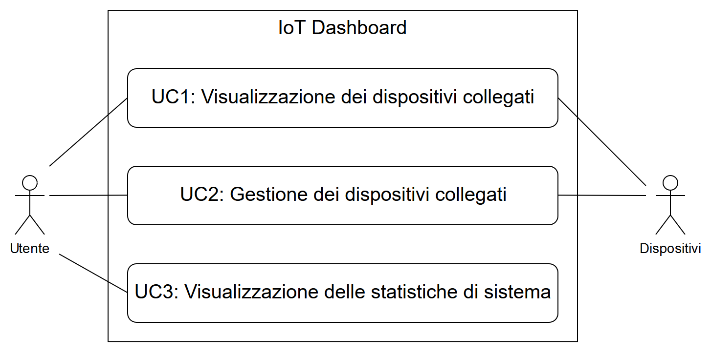

# Analisi dei Requisiti

## Introduzione

### Scopo del documento

Lo scopo di questo documento è quello di definire i requisiti emersi dall’analisi del progetto di stage.
Il presente, tra le altre cose, tratta di:

-   descrizione dei requisiti;
-   descrizione dei casi d’uso;
-   descrizione degli attori coinvolti.

### Scopo del progetto

Lo stage prevede lo sviluppo e la realizzazione di una dashboard per la gestione di dispositivi interconnessi (IoT). L'idea alla base del sistema è quella di un centro di controllo attraverso cui l'utente del sistema gestisca i dispositivi smart presenti nella propria rete domestica.

## Descrizione

### Obiettivi del prodotto

La crescente diffusione di dispositivi interconnessi atti a semplificare la vita quotidiana ha spinto numerosi produttori a creare ecosistemi chiusi in cui questi dispositivi potessero comunicare tra loro, isolandosi da prodotti complementari della concorrenza.
L'obiettivo del prodotto è quello di fornire un'interfaccia unificata per la gestione dei dispositivi connessi, consentendo all'utente l'accesso all'interfaccia proprietaria di ciascun dispositivo.

### Funzioni del prodotto

L'idea alla base del sistema è quella di essere un centro di controllo attraverso cui l'utente del sistema gestisce i dispositivi smart presenti nella propria rete domestica, permettendo operazioni del tipo:

-   avvio/spegnimento di un dispositivo;
-   monitoraggio dei dispositivi collegati;
-   richiesta di dati per conoscere lo stato dei dispositivi (es. per una lampadina: accesa/spenta, assorbimento energetico, ecc.);
-   collegamento all'eventuale interfaccia proprietaria del dispositivo (es. supporto tecnico).

Data la natura altamente dinamica di questo mercato una delle funzioni del prodotto sarà quella di simulare dispositivi collegati al sistema.
I dispositivi collegati al sistema possono trattarsi di 2 tipologie:

1.  sensori, la cui unica funzione è quella di trasmettere informazioni riguardanti lo stato di un particolare ambiente o oggetto (temperatura di una stanza);
2.  dispositivi attivi, che rispondono a determinati eventi in modi prestabiliti.

Entrambe le categorie di dispositivi comunicano con il sistema utilizzando il protocollo **MQTT**[1](#1), ritenuto dallo studente il protocollo più adatto per il sistema in quanto esso:

1.  è un protocollo _data agnostic_, ossia che non pone vincoli sulla struttura dei dati scambiati nella rete;
2.  è un protocollo efficiente in quanto trasmette informazioni con un overhead minimo;
3.  è un protocollo che permette l'aggiunta e la rimozione di dispositivi dinamicamente,  richiedendo intervento manuale minimo all'utente.

Tutti i dispositivi contengono al loro interno informazioni relative a modello, revisione, produttore e anno di produzione del dispositivo.

#### Funzioni del prodotto: sensori

La funzionalità principale offerta dai sensori è l'invio di informazioni periodicamente legati a ciò che il sensore misura.

L'invio di informazioni periodiche avviene in automatico, secondo i parametri impostati dal produttore del sensore.

Altre 2 funzionalità legate alle _capabilities hardware_ del sensore sono:

1.  **memorizzazione locale**: il produttore dota il sensore di una piccola memoria riscrivibile, interrogabile direttamente producendo dati in un formato stabilito dal produttore. Nei casi d'uso presi in considerazione questa funzionalità è utile in caso di perdita di connessione o malfunzionamento del centro di controllo. Nel caso in cui questa funzionalità sia presente, il sensore provvede a trasmettere i dati raccolti alla prossima riconnessione con il centro di controllo.
2.  **disconnessione forzata**: il centro di controllo può richiedere ai sensori di disconnettersi dalla rete per un periodo di tempo per motivi di diagnostica o di sovraccarico della rete. Questa funzionalità richiede che il sensore abbia hardware in grado di ricevere segnali e non solo trasmetterli.

| Funzionalità dei sensori | Frequenza    | Attivazione | Obbligatorietà |
| ------------------------ | ------------ | ----------- |:--------------:|
| Invio informazioni       | Periodica    | Automatica  |    &#10004;    |
| Memoria locale           | N.D.         | Automatica  |    &#10005;    |
| Disconnessione forzata   | Su richiesta | Manuale     |    &#10005;    |

#### Funzioni del prodotto: dispositivi attivi

I dispositivi attivi presentano le seguenti funzionalità:

1.  lista degli eventi gestiti dal dispositivo;
2.  risposta agli eventi esterni;
3.  invio di informazioni sullo stato energetico del dispositivo;
4.  spegnimento del dispositivo.

La lista degli eventi gestiti deve essere richiesta al dispositivo per conoscere le sue funzionalità e inviare gli eventi corretti.
La risposta agli eventi gestiti è automatica e avviene a ogni evento occorso.
Le funzionalità legate alla gestione degli eventi sono direttamente implementate dai produttori dei dispositivi.

L'invio delle informazioni sullo stato energetico del dispositivo richiede che il produttore abbia dotato il dispositivo di unità di _power management_ e perciò potrebbe non essere disponibile per tutti i dispositivi collegati.

| Funzionalità dei dispositivi attivi | Frequenza               | Attivazione | Obbligatorietà |
| ----------------------------------- | ----------------------- | ----------- |:--------------:|
| Lista eventi gestiti                | Su richiesta            | Manuale     |    &#10004;    |
| Risposta eventi gestiti             | Ad ogni evento ricevuto | Automatica  |    &#10004;    |
| Informazioni stato energetico       | Su richiesta            | Manuale     |    &#10005;    |
| Spegnimento                         | Su richiesta            | Manuale     |    &#10004;    |

#### Funzioni del prodotto: centro di controllo

Il centro di controllo è il sistema, composto da un insieme di servizi, che:

1.  gestisce i dispositivi collegati al sistema;
2.  riceve, elabora e memorizza le informazioni utili provenienti dai dispositivi (anche per fini diagnostici);
3.  mette a disposizione le informazioni raccolte per i client che interrogano il centro di controllo.

Il dati ricevuti dal centro di controllo possono in una forma grezza e perciò è necessario che il centro di controllo li elabori, a seconda della provenienza dei dati, al fine di renderli comprensibili anche da umani.
Le informazioni raccolte sono messe a disposizione ai client in tempo reale.

### Caratteristiche degli utenti del sistema

Lo studente prevede che gli utenti del sistema non abbiano alcuna competenza particolare.

### Piattaforma di esecuzione

La piattaforma di esecuzione del prodotto è Docker, attraverso la composizione di container.
L'utente accede alle funzionalità del prodotto attraverso una interfaccia Web, opportunamente progettata per essere reattiva (ottimizzata per mobile).

## Casi d'uso

I casi d’uso sono catalogati come:

UC[numero][caso]

Dove:
-   `UC` specifica che si sta parlando di un caso d’uso;
-   `numero` è assoluto e rappresenta un riferimento univoco al caso d’uso in questione;
-   `caso` individua eventuali diramazioni all’interno dello stesso caso d’uso.

La breve descrizione di ciascun caso d’uso presenta:
-   gli attori del caso d’uso;
-   lo scopo e la descrizione del caso d’uso.

Di seguito viene presentata la lista degli attori dei casi d’uso:
-   **Utente**: rappresenta l'utente che interagisce con la dashboard;
-   **Dispositivi**: rappresentano l'insieme di apparati collegati al sistema che forniscono i dati per popolare la dashboard.

### UC1: Visualizzazione dei dispositivi collegati

-   **Attori**:  
    L'utente che interagisce con la dashboard. I dispositivi, forniscono le proprie informazioni alla dashboard.
-   **Scopo e descrizione**:  
    L'utente interroga la dashboard per conoscere lo stato dei dispositivi collegati.

### UC2: Gestione dei dispositivi collegati

-   **Attori**:  
    L'utente che interagisce con la dashboard. La dashboard permette l'accesso alle funzionalità messe a disposizione dai dispositivi.
-   **Scopo e descrizione**:  
    L'utente interroga la dashboard per accedere alle funzionalità offerte dai dispositivi.

### UC3: Visualizzazione delle statistiche di sistema

-   **Attori**:  
    L'utente che interagisce con la dashboard.
-   **Scopo e descrizione**:  
    L'utente interroga la dashboard per visualizzare le statistiche di sistema per conoscerne lo stato di salute e diagnosticare eventuali malfunzionamenti.

# Note

<a name="1">1:</a> MQTT è un protocollo di messaggistica leggero nato per l'utilizzo con sensori a basso consumo energetico. Maggiori informazioni: [Analisi del protocollo MQTT - `../protocols/mqtt.md`](../protocols/mqtt.md).
