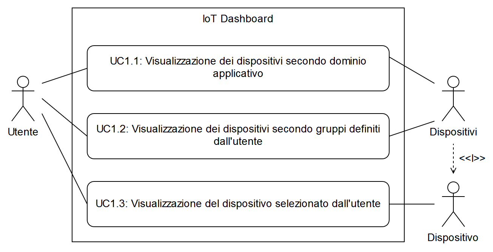

[_Torna al documento indice/Back_](./README.md)

# Analisi dei Requisiti

## Introduzione

### Scopo del documento

Lo scopo di questo documento è quello di definire i requisiti emersi dall’analisi del progetto di stage.
Il presente, tra le altre cose, tratta di:

-   descrizione dei requisiti;
-   descrizione dei casi d’uso;
-   descrizione degli attori coinvolti.

### Scopo del progetto

Lo stage prevede lo sviluppo e la realizzazione di una dashboard per la gestione di dispositivi interconnessi (IoT). L'idea alla base del sistema è quella di un centro di controllo attraverso cui l'utente del sistema gestisca i dispositivi smart presenti nella propria rete domestica.

## Descrizione

### Obiettivi del prodotto

La crescente diffusione di dispositivi interconnessi atti a semplificare la vita quotidiana ha spinto numerosi produttori a creare ecosistemi chiusi in cui questi dispositivi potessero comunicare tra loro, isolandosi da prodotti complementari della concorrenza.
L'obiettivo del prodotto è quello di fornire un'interfaccia unificata per la gestione dei dispositivi connessi, consentendo all'utente l'accesso all'interfaccia proprietaria di ciascun dispositivo.

### Funzioni del prodotto

L'idea alla base del sistema è quella di essere un centro di controllo attraverso cui l'utente del sistema gestisce i dispositivi smart presenti nella propria rete domestica, permettendo operazioni del tipo:

-   avvio/spegnimento di un dispositivo;
-   monitoraggio dei dispositivi collegati;
-   richiesta di dati per conoscere lo stato dei dispositivi (es. per una lampadina: accesa/spenta, assorbimento energetico, ecc.);
-   collegamento all'eventuale interfaccia proprietaria del dispositivo (es. supporto tecnico).

Data la natura altamente dinamica di questo mercato una delle funzioni del prodotto sarà quella di simulare dispositivi collegati al sistema.
I dispositivi collegati al sistema possono trattarsi di 2 tipologie:

1.  sensori, la cui unica funzione è quella di trasmettere informazioni riguardanti lo stato di un particolare ambiente o oggetto (temperatura di una stanza);
2.  dispositivi attivi, che rispondono a determinati eventi in modi prestabiliti.

Entrambe le categorie di dispositivi comunicano con il sistema utilizzando il protocollo **MQTT**[1](#1), ritenuto dallo studente il protocollo più adatto per il sistema in quanto esso:

1.  è un protocollo _data agnostic_, ossia che non pone vincoli sulla struttura dei dati scambiati nella rete;
2.  è un protocollo efficiente in quanto trasmette informazioni con un overhead minimo;
3.  è un protocollo che permette l'aggiunta e la rimozione di dispositivi dinamicamente,  richiedendo intervento manuale minimo all'utente.

Tutti i dispositivi contengono al loro interno informazioni relative a modello, revisione, produttore e anno di produzione del dispositivo.

#### Funzioni del prodotto: sensori

La funzionalità principale offerta dai sensori è l'invio di informazioni periodicamente legati a ciò che il sensore misura.

L'invio di informazioni periodiche avviene in automatico, secondo i parametri impostati dal produttore del sensore.

Altre 2 funzionalità legate alle _capabilities hardware_ del sensore sono:

1.  **memorizzazione locale**: il produttore dota il sensore di una piccola memoria riscrivibile, interrogabile direttamente producendo dati in un formato stabilito dal produttore. Nei casi d'uso presi in considerazione questa funzionalità è utile in caso di perdita di connessione o malfunzionamento del centro di controllo. Nel caso in cui questa funzionalità sia presente, il sensore provvede a trasmettere i dati raccolti alla prossima riconnessione con il centro di controllo.
2.  **disconnessione forzata**: il centro di controllo può richiedere ai sensori di disconnettersi dalla rete per un periodo di tempo per motivi di diagnostica o di sovraccarico della rete. Questa funzionalità richiede che il sensore abbia hardware in grado di ricevere segnali e non solo trasmetterli.

| Funzionalità dei sensori | Frequenza    | Attivazione | Obbligatorietà |
| ------------------------ | ------------ | ----------- |:--------------:|
| Invio informazioni       | Periodica    | Automatica  |    &#10004;    |
| Memoria locale           | N.D.         | Automatica  |    &#10005;    |
| Disconnessione forzata   | Su richiesta | Manuale     |    &#10005;    |

#### Funzioni del prodotto: dispositivi attivi

I dispositivi attivi presentano le seguenti funzionalità:

1.  lista degli eventi gestiti dal dispositivo;
2.  risposta agli eventi esterni;
3.  invio di informazioni sullo stato energetico del dispositivo;
4.  spegnimento del dispositivo.

La lista degli eventi gestiti deve essere richiesta al dispositivo per conoscere le sue funzionalità e inviare gli eventi corretti.
La risposta agli eventi gestiti è automatica e avviene a ogni evento occorso.
Le funzionalità legate alla gestione degli eventi sono direttamente implementate dai produttori dei dispositivi.

L'invio delle informazioni sullo stato energetico del dispositivo richiede che il produttore abbia dotato il dispositivo di unità di _power management_ e perciò potrebbe non essere disponibile per tutti i dispositivi collegati.

| Funzionalità dei dispositivi attivi | Frequenza               | Attivazione | Obbligatorietà |
| ----------------------------------- | ----------------------- | ----------- |:--------------:|
| Lista eventi gestiti                | Su richiesta            | Manuale     |    &#10004;    |
| Risposta eventi gestiti             | Ad ogni evento ricevuto | Automatica  |    &#10004;    |
| Informazioni stato energetico       | Su richiesta            | Manuale     |    &#10005;    |
| Spegnimento                         | Su richiesta            | Manuale     |    &#10004;    |

#### Funzioni del prodotto: centro di controllo

Il centro di controllo è il sistema, composto da un insieme di servizi, che:

1.  gestisce i dispositivi collegati al sistema;
2.  riceve, elabora e memorizza le informazioni utili provenienti dai dispositivi (anche per fini diagnostici);
3.  mette a disposizione le informazioni raccolte per i client che interrogano il centro di controllo.

Il dati ricevuti dal centro di controllo possono in una forma grezza e perciò è necessario che il centro di controllo li elabori, a seconda della provenienza dei dati, al fine di renderli comprensibili anche da umani.
Le informazioni raccolte sono messe a disposizione ai client in tempo reale.

### Caratteristiche degli utenti del sistema

Lo studente prevede che gli utenti del sistema non abbiano alcuna competenza particolare.

### Piattaforma di esecuzione

La piattaforma di esecuzione del prodotto è Docker, attraverso la composizione di container.
L'utente accede alle funzionalità del prodotto attraverso una interfaccia Web, opportunamente progettata per essere reattiva (ottimizzata per mobile).

## Casi d'uso

I casi d’uso sono catalogati come:

UC[numero][caso]

dove:
-   `UC` specifica che si sta parlando di un caso d’uso;
-   `numero` è assoluto e rappresenta un riferimento univoco al caso d’uso in questione;
-   `caso` individua eventuali diramazioni all’interno dello stesso caso d’uso.

La breve descrizione di ciascun caso d’uso presenta:
-   gli attori del caso d’uso;
-   lo scopo e la descrizione del caso d’uso.

Di seguito viene presentata la lista degli attori dei casi d’uso:
-   **Utente**: rappresenta l'utente che interagisce con la dashboard;
-   **Dispositivi**: rappresentano l'insieme di apparati collegati al sistema che forniscono i dati per popolare la dashboard.

<i>Sommario dei casi d'uso</i>

### UC1: Visualizzazione dei dispositivi collegati

-   **Attori**:  
    L'utente che interagisce con la dashboard. I dispositivi, forniscono le proprie informazioni alla dashboard.
-   **Scopo e descrizione**:  
    L'utente interroga la dashboard per conoscere lo stato dei dispositivi collegati.

<i>Approfondimento UC1</i>

#### UC1.1: Visualizzazione dei dispositivi collegati secondo dominio applicativo

-   **Attori**:  
    L'utente che interagisce con la dashboard. I dispositivi che forniscono le proprie informazioni alla dashboard.
-   **Scopo e descrizione**:  
    L'utente interroga la dashboard per conoscere lo stato dei dispositivi collegati. In questa visualizzazione la dashboard mostra i dispositivi raggruppati secondo dominio applicativo (gruppo relativo alla termodinamica domestica, gruppo relativo alla illuminazione, ecc.).

#### UC1.2: Visualizzazione dei dispositivi collegati secondo gruppi definiti dall'utente

-   **Attori**:  
    L'utente che interagisce con la dashboard. I dispositivi che forniscono le proprie informazioni alla dashboard.
-   **Scopo e descrizione**:  
    L'utente interroga la dashboard per conoscere lo stato dei dispositivi collegati. In questa visualizzazione la dashboard mostra i dispositivi raggruppati secondo le preferenze dell'utente.

#### UC1.3: Visualizzazione del dispositivo selezionato dall'utente

-   **Attori**:  
    L'utente che interagisce con la dashboard. Il dispositivo selezionato dall'utente tra tutti quelli collegati al sistema.
-   **Scopo e descrizione**:  
    L'utente interroga la dashboard per conoscere lo stato del dispositivo selezionato. In questa visualizzazione la dashboard mostra le informazioni provenienti dal dispositivo.

<i>Approfondimento UC1.3</i>

##### UC1.3.1: Visualizzazione delle informazioni provenienti dal dispositivo

-   **Attori**:  
    L'utente che interagisce con la dashboard. Il dispositivo selezionato dall'utente tra tutti quelli collegati al sistema.
-   **Scopo e descrizione**:  
    La dashboard mostra all'utente le informazioni provenienti dal dispositivo.

<i>Approfondimento UC1.3.1</i>

###### UC1.3.1.1: Visualizzazione nome del dispositivo

-   **Attori**:  
    L'utente che interagisce con la dashboard. Il dispositivo selezionato dall'utente tra tutti quelli collegati al sistema.
-   **Scopo e descrizione**:  
    La dashboard mostra all'utente il nome _user-friendly_ dato dal produttore al dispositivo.

###### UC1.3.1.2: Visualizzazione categoria del dispositivo

-   **Attori**:  
    L'utente che interagisce con la dashboard. Il dispositivo selezionato dall'utente tra tutti quelli collegati al sistema.
-   **Scopo e descrizione**:  
    La dashboard mostra all'utente il dominio applicativo del dispositivo (illuminazione, ecc.).

###### UC1.3.1.3: Visualizzazione dati provenienti dal dispositivo

-   **Attori**:  
    L'utente che interagisce con la dashboard. Il dispositivo selezionato dall'utente tra tutti quelli collegati al sistema.
-   **Scopo e descrizione**:  
    La dashboard mostra all'utente ii dati raccolti dal sistema provenienti dal dispositivo selezionato.

##### UC1.3.2: Visualizzazione delle specifiche tecniche del dispositivo

-   **Attori**:  
    L'utente che interagisce con la dashboard. Il dispositivo selezionato dall'utente tra tutti quelli collegati al sistema.
-   **Scopo e descrizione**:  
    La dashboard mostra all'utente le specifiche tecniche del dispositivo.

<i>Approfondimento UC1.3.2</i>

###### UC1.3.2.1: Visualizzazione produttore del dispositivo

-   **Attori**:  
    L'utente che interagisce con la dashboard. Il dispositivo selezionato dall'utente tra tutti quelli collegati al sistema.
-   **Scopo e descrizione**:  
    La dashboard mostra all'utente il nome del produttore del dispositivo.

###### UC1.3.2.2: Visualizzazione modello del dispositivo

-   **Attori**:  
    L'utente che interagisce con la dashboard. Il dispositivo selezionato dall'utente tra tutti quelli collegati al sistema.
-   **Scopo e descrizione**:  
    La dashboard mostra all'utente il nome commerciale scelto dal produttore per il  dispositivo.

###### UC1.3.2.3: Visualizzazione revisione del dispositivo

-   **Attori**:  
    L'utente che interagisce con la dashboard. Il dispositivo selezionato dall'utente tra tutti quelli collegati al sistema.
-   **Scopo e descrizione**:  
    La dashboard mostra all'utente un identificativo di versione del dispositivo (anno o  numero di versione).

##### UC1.3.3: Visualizzazione delle operazioni disponibili per il dispositivo

-   **Attori**:  
    L'utente che interagisce con la dashboard. Il dispositivo selezionato dall'utente tra tutti quelli collegati al sistema.
-   **Scopo e descrizione**:  
    La dashboard mostra all'utente le funzionalità offerte dal dispositivo.

##### UC1.3.4: Collegamento all'interfaccia proprietaria del dispositivo

-   **Attori**:  
    L'utente che interagisce con la dashboard. Il dispositivo selezionato dall'utente tra tutti quelli collegati al sistema. L'interfaccia proprietaria progettata e realizzata dal produttore del dispositivo.
-   **Scopo e descrizione**:  
    La dashboard mostra all'utente il collegamento all'interfaccia proprietaria del dispositivo.

### UC2: Gestione dei dispositivi collegati

-   **Attori**:  
    L'utente che interagisce con la dashboard. La dashboard permette l'accesso alle funzionalità messe a disposizione dai dispositivi.
-   **Scopo e descrizione**:  
    L'utente interroga la dashboard per accedere alle funzionalità offerte dai dispositivi.

<i>Approfondimento UC2</i>

#### UC2.1: Visualizzazione dei dispositivi collegati

-   **Attori**:  
    L'utente che interagisce con la dashboard. I dispositivi collegati al sistema.
-   **Scopo e descrizione**:  
    La dashboard presenta all'utente la lista di dispositivi collegati al sistema per permettere all'utente di selezionare quale dispositivo gestire.

#### UC2.2: Creazione di un gruppo di dispositivi personalizzato dall'utente

-   **Attori**:  
    L'utente che interagisce con la dashboard. I dispositivi collegati al sistema.
-   **Scopo e descrizione**:  
    La dashboard permette all'utente di creare un gruppo personalizzato di dispositivi, facilitando la visualizzazione dei dispositivi nella pagina principale della dashboard.

<i>Approfondimento UC2.2</i>

###### UC2.2.1: Inserimento nome del gruppo

-   **Attori**:  
    L'utente che interagisce con la dashboard.
-   **Scopo e descrizione**:  
    L'utente fornisce al sistema il nome del gruppo da creare.

###### UC2.2.2: Scelta dei dispositivi da inserire nel gruppo

-   **Attori**:  
    L'utente che interagisce con la dashboard. I dispositivi collegati al sistema.
-   **Scopo e descrizione**:  
    La dashboard permette all'utente di scegliere quali dispositivi compongono il gruppo.

#### UC2.3: Modifica di un gruppo di dispositivi personalizzato

-   **Attori**:  
    L'utente che interagisce con la dashboard. I dispositivi collegati al sistema.
-   **Scopo e descrizione**:  
    La dashboard permette all'utente di modificare un gruppo personalizzato esistente per rinominare il gruppo e aggiungere o togliere uno o più dispositivi da un gruppo.

<i>Approfondimento UC2.3</i>

###### UC2.3.1: Modifica nome del gruppo

-   **Attori**:  
    L'utente che interagisce con la dashboard.
-   **Scopo e descrizione**:  
    La dashboard mostra all'utente il nome corrente del gruppo, permettendone la modifica.

###### UC2.3.2: Aggiunta di nuovi dispositivi al gruppo

-   **Attori**:  
    L'utente che interagisce con la dashboard. I dispositivi collegati al sistema.
-   **Scopo e descrizione**:  
    La dashboard permette all'utente di scegliere quali dispositivi non presenti nel gruppo aggiungere.

###### UC2.3.3: Rimozione di dispositivi esistenti dal gruppo

-   **Attori**:  
    L'utente che interagisce con la dashboard. Il dispositivo selezionato dall'utente tra tutti quelli collegati al sistema.
-   **Scopo e descrizione**:  
    La dashboard permette all'utente di scegliere quali dispositivi presenti nel gruppo da rimuovere.

#### UC2.4: Rimozione di un gruppo di dispositivi personalizzato

-   **Attori**:  
    L'utente che interagisce con la dashboard. I dispositivi collegati al sistema.
-   **Scopo e descrizione**:  
    La dashboard permette all'utente di rimuovere un gruppo personalizzato esistente.

#### UC2.5: Visualizzazione delle operazioni disponibili per il dispositivo selezionato dall'utente

-   **Attori**:  
    L'utente che interagisce con la dashboard. Il dispositivo selezionato dall'utente tra tutti quelli collegati al sistema.
-   **Scopo e descrizione**:  
    La dashboard permette all'utente di conoscere la lista delle operazioni disponibili per il dispositivo selezionato (ad esempio: accensione e spegnimento per una sorgente di illuminazione).

### UC3: Visualizzazione delle statistiche di sistema

-   **Attori**:  
    L'utente che interagisce con la dashboard.
-   **Scopo e descrizione**:  
    L'utente interroga la dashboard per visualizzare le statistiche di sistema per conoscerne lo stato di salute e diagnosticare eventuali malfunzionamenti.

## Requisiti

Vengono ora presentati i requisiti emersi durante l’analisi dei casi d’uso. Lo studente ha deciso di inserire i requisiti in una tabella dei requisiti per permetterne una consultazione agevole.
La tabella dei requisiti li presenta specificandone:
-   **Identificativo** (secondo le regole indicate successivamente);
-   **Categoria** di appartenenza fra:
    -   **Obbligatorio**, per i requisiti irrinunciabili;
    -   **Desiderabile**, per i requisiti non strettamente necessari ma che offrono un
    valore aggiunto riconoscibile;
    -   **Opzionale**, per i requisiti relativamente utili o contrattabili in seguito.
-   **Descrizione** esaustiva del requisito;

### Catalogazione requisiti
I requisiti sono identificati come segue:

R[Categoria][Tipo][numero]

Dove:
-   `R` specifica che si tratta di un requisito;
-   `Categoria` indica se si tratta di un requisito:
    -   Obbligatorio: `M` (_mandatory_);
    -   Desiderabile: `A` (_advisable_);
    -   Opzionale: `O` (_optional_);
-   `Tipo` indica la tipologia del requisito, che può essere:
    -   Di vincolo: `O` (_obligation_);
    -   Funzionale: `F` (_functional_);
    -   Di qualità: `Q` (_quality_);
-   `Numero` è assoluto e rappresenta un riferimento univoco al requisito in questione.

### Tabella dei requisiti

#### Tabella dei requisiti di vincolo

| Identificativo | Categoria    | Descrizione                                                                                                     |
|----------------|--------------|-----------------------------------------------------------------------------------------------------------------|
| RMO1           | Obbligatorio | Il sistema deve essere progettato secondo lo stile di progettazione a microservizi.                             |
| RAO2           | Desiderabile | Il sistema può essere implementato utilizzando il linguaggio JavaScript secondo lo standard EcmaScript 2016.    |
| RAO3           | Desiderabile | Il sistema può essere implementato utilizzando il framework Node.JS per il _backend_ e React per il _frontend_. |
| RM04           | Obbligatorio | Il sistema deve utilizzare il protocollo MQTT.                                                                  |

#### Tabella dei requisiti funzionali

| Identificativo | Categoria    | Descrizione                                                                                      |
|----------------|--------------|--------------------------------------------------------------------------------------------------|
| RMF1           | Obbligatorio | L'utente deve poter visualizzare tutti i dispositivi collegati al sistema.                       |
| RMF2           | Obbligatorio | L'utente deve poter visualizzare i dispositivi collegati secondo dominio applicativo.            |
| RAF3           | Desiderabile | L'utente può visualizzare i dispositivi collegati secondo gruppi personalizzati.                 |
| RMF4           | Obbligatorio | L'utente deve poter selezionare uno dei dispositivi collegati per visualizzarne le informazioni. |
| RAF5           | Desiderabile | L'utente può creare un gruppo di dispositivi. personalizzato                                     |
| RAF6           | Desiderabile | L'utente può modificare uno dei gruppi personalizzati esistenti.                                 |
| RAF7           | Desiderabile | L'utente può rimuovere uno dei gruppi di dispositivi personalizzati esistenti.                   |
| RMF8           | Obbligatorio | L'utente deve poter visualizzare le operazioni messe a disposizione dal dispositivo selezionato. |
| RMF9           | Obbligatorio | L'utente deve poter selezionare una delle operazioni disponibili.                                |
| RMF10          | Obbligatorio | L'utente deve poter visualizzare le statistiche di utilizzo del sistema sistema.                 |

#### Tabella dei requisiti di qualità

| Identificativo | Categoria | Descrizione                                                                                                 |
| -------------- | --------- | ----------------------------------------------------------------------------------------------------------- |
| ROQ1           | Opzionale | Il sistema deve essere testato, raggiungendo i seguenti obiettivi: <ul><li>_statement coverage_ > 80 %</li><li>_branch coverage_ > 90 %</li> |

# Note

<a name="1">1:</a> MQTT è un protocollo di messaggistica leggero nato per l'utilizzo con sensori a basso consumo energetico. Maggiori informazioni: [Analisi del protocollo MQTT - `../protocols/mqtt.md`](../protocols/mqtt.md).
