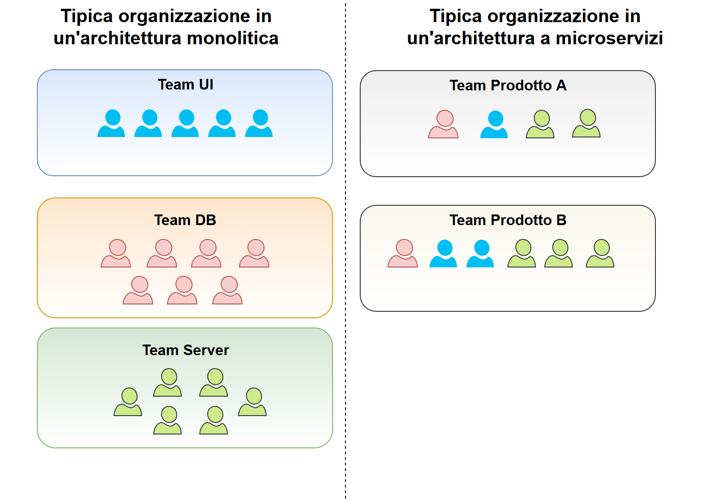
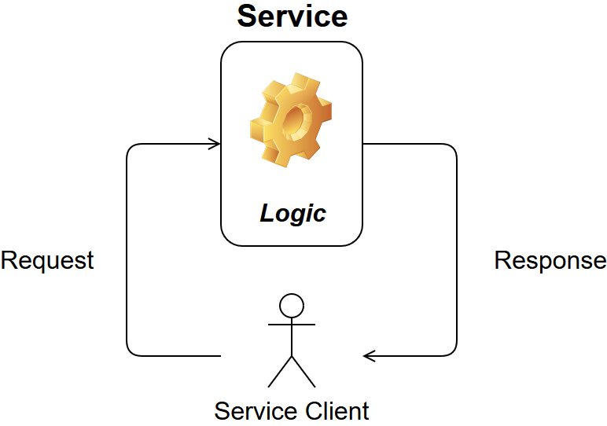
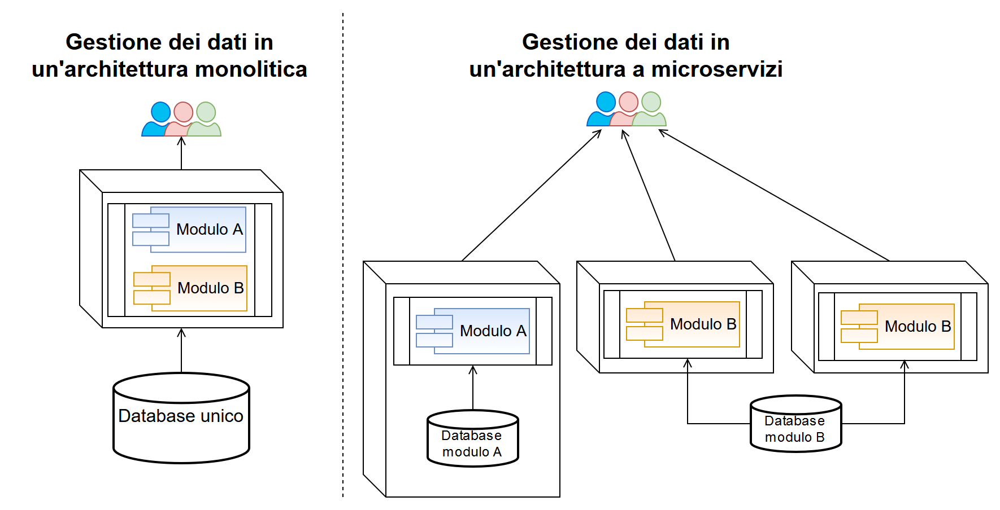

# Microservices
_Fonti:_

-   [https://martinfowler.com/articles/microservices.html](https://martinfowler.com/articles/microservices.html)
-   [https://en.wikipedia.org/wiki/Microservices](https://en.wikipedia.org/wiki/Microservices)

_Edizione HTML:_  [HTML](https://cdn.rawgit.com/niktekusho/IoT-docs/1844e1c2/training/microservices/microservices.html)

# Introduzione
L'espressione "_Architettura a microservizi_" è sempre più comune tra gli sviluppatori di applicazioni enterprise per descrivere un metodo di progettazione delle applicazioni come **insiemi di servizi eseguibili indipendentemente** (ogni servizio esegue su un processo indipendente), **che comunicano tra loro grazie a meccanismi di comunicazione leggeri** (solitamente attraverso API HTTP).

# Architetture a confronto: **Microservizi** vs **Monolitiche**

## Architettura monolitica

Un'applicazione monolitica è **progettata e costruita per essere una singola unità in esecuzione**. Solitamente un'applicazione web monolitica è divisa in 3 parti:

1.  interfaccia utente (pagine web);
2.  database;
3.  applicazione server.

A sua volta, l'applicazione server:

-   gestisce le richieste HTTP;
-   esegue la business logic dell'applicazione;
-   carica e aggiorna dati dal/nel database;
-   seleziona e popola le pagine web inviate al browser dell'utente.

Nelle applicazioni monolitiche si cerca di organizzare le **componenti** del sistema sfruttando i costrutti fondamentali dei linguaggi di programmazione:

-   funzioni;
-   classi;
-   namespace o package.

Per aumentare la **disponibilità** delle applicazioni monolitiche si usa **replicare istanze dell'applicazione in molteplici server**, avendo un server di load balancing che bilancia il traffico nel modo più appropriato.

Tra i difetti delle applicazioni monolitiche si possono evidenziare:

-   modifiche a una piccola parte all'applicazione richiedono la **ricompilazione** e la **ridistribuzione** dell'applicazione;
-   all'accrescere della complessità dell'applicazione aumenta anche la **difficoltà nel mantenere le modifiche isolate ai moduli di competenza**;
-   scalare l'applicazione richiede l'esecuzione di istanze multiple della stessa applicazione, ignorando di fatto eventuali requisiti di efficienza (solitamente alcune componenti del sistema non richiedono un aumento di throughput[1](#1)).

## Architettura a microservizi

Per lo stile architetturale a microservizi **non esistono definizioni formali**, tuttavia è possibile ricavare delle **caratteristiche comuni** nei progetti che sono diventati nel tempo esempi di _best-practice_.
Non tutte le architetture a microservizi hanno tutte le caratteristiche elencate in seguito, ma ci si aspetta che la maggior parte delle architetture esibisca quante più caratteristiche possibili.

L'aspetto cruciale delle architetture a microservizi verte sulla definizione di **componente**: la definizione comunemente accettata è quella di "_unità di software che è indipendentemente aggiornabile e sostituibile in un sistema_".
Le architetture a microservizi usano i **servizi** per realizzare tale definizione di componente.
A titolo di confronto con gli approcci di sviluppo tradizionali è possibile introdurre la nozione di **libreria**. Le librerie sono componenti insiti in un'applicazione tanto da risiedere nello stesso spazio di memoria dell'applicazione e che per essere invocate richiedono una chiamata di funzione in memoria. I servizi sono componenti che vivono nel sistema come processi separati, sfruttando vari tipi di comunicazione interprocesso: richieste web, chiamate di funzione remote (RPC[2](#2)).

Il vantaggio principale dei servizi rispetto alle librerie consiste nel fatto che i **servizi sono rilasciabili indipendentemente dal sistema**. Data la natura dell'architettura a microservizi, **modifiche a un singolo servizio comportano il rilascio di una nuova versione solamente per quel servizio e non dell'intera applicazione**. Una buona architettura a microservizi quindi mira a progettare e implementare servizi che circoscrivano chiaramente il loro scopo.

L'uso di servizi come componenti consente inoltre di rendere esplicita l'interfaccia dei componenti[3](#3).
Spesso solamente la documentazione e la disciplina prevengono usi impropri di una componente da parte di uno sviluppatore esterno, rischiando di causare un alto accoppiamento[4](#4) tra componenti. **I servizi facilitano il rispetto delle interfacce pubblicate attraverso l'uso di meccanismi di chiamate remote esplicite**.

Il difetto che si annovera all'uso di servizi come componenti risiede nell'utilizzo di **chiamate remote** per la comunicazione tra servizi: esse **richiedono più risorse rispetto alle chiamate di funzione intraprocesso** e quindi è necessario progettare le API di ciascun servizio rivolgendo maggiore attenzione all'aspetto prestazionale delle stesse.

## Organizzazione aziendale

Altre differenze sono riscontrabili anche dal punto di vista della suddivisione delle persone impegnate nello sviluppo dell'applicazione.
Solitamente applicazioni complesse sviluppate seguendo l'architettura monolitica sono divise in _team_ con **competenze isolate**: _team_ esperto in UI, _team_ specializzato in DB Management, ecc. Quando le persone sono così fortemente isolate, anche una semplice modifica può richiedere **l'intervento di altre persone in _team_ diversi**, causando inefficienze nel processo di sviluppo.
L'approccio microservices-oriented alla suddivisione invece pone l'accento sulle capacità di business: ogni _team_ inerente un particolare settore di business **si occupa dell'intero prodotto** per quel settore (sviluppando interamente UI, DB, ecc.). I _team_ in questo approccio sono multidisciplinari e gli scambi con altri settori riflettono le effettive dipendenze tra un settore e un altro all'interno dell'azienda.

Un esempio di quest'approccio alla suddivisione lo si ritrova in Amazon, dove vige il motto _"you build, you run it"_ (_"tu lo costruisci, tu lo esegui"_). In Amazon ogni _team_ ha completa responsabilità del prodotto anche in ambiente di produzione, mettendo in comunicazione diretta sviluppatori e utenti del prodotto per le attività di supporto e manutenzione.

## Comunicazione tra servizi

Applicazioni assemblate con microservizi mirano ad essere **più disaccoppiate e più coese possibile**: ricevendo una richiesta, applicando la propria logica e producendo una risposta.

Le comunicazioni tra servizi sono orchestrate usando semplici protocolli REST-like[5](#5).
I 2 protocolli più usati sono:

1.  **richieste/risposte HTTP** secondo API ben dettagliate;
2.  **messaggistica in un canale di comunicazione snello**. I servizi producono e consumano i messaggi che circolano nel canale di comunicazione, secondo regole di accesso definite.

## Decentralizzazione della gestione delle informazioni

Quando un'applicazione è suddivisa in molteplici componenti sorgono naturalmente dubbi sulla gestione delle informazioni che ciascuna componente gestisce.
Solitamente nelle architetture monolitiche i domini dell'applicazione vengono astratti **scegliendo una fra le tecniche di modellazione disponibili e applicandola a tutti i domini**; i modelli prodotti sono poi veicolati su singoli storage di dati (ad es. unico database).
L'architettura a microservizi invece propone di **concepire i modelli in autonomia per ogni singolo servizio**, utilizzando le tecniche ritenute più appropriate.
Questa decentralizzazione dei modelli si riflette anche sulla decentralizzazione delle decisioni di storage dei dati.
**Ogni servizio gestisce il proprio database**: il database potrebbe essere quindi un'istanza di una stessa piattaforma tecnologica oppure una piattaforma specifica e ottimizzata per il caso d'uso del servizio.
Questo approccio alla gestione della persistenza è chiamato **Polyglot Persistence**[6](#6).

La decentralizzazione delle decisioni di storage implica una maggior attenzione verso gli aggiornamenti dei dati.
L'approccio comune agli aggiornamenti in un'architettura monolitica è quello di usare le transazioni per garantire la consistenza dei dati prima e dopo ciascun aggiornamento.
L'utilizzo di **transazioni** è un **grave limite per l'architettura a microservizi**, in quanto le transazioni impongono un ordine temporale che potrebbe non essere rispettato, causando inconsistenze dei dati salvati.
É per questo che le architetture a microservizi enfatizzano l'utilizzo di comunicazioni non vincolanti (_transactionless_): eventuali inconsistenze vengono segnalate e risolte grazie a operazioni correttive.

## Note di progettazione

Una conseguenza nell'utilizzo dei servizi come componenti è che le applicazioni devono **prevedere e tollerare malfunzionamenti** nei servizi.
L'utilizzatore dei servizi deve quindi rispondere ai malfunzionamenti nel modo più elegante possibile.
Dato l'aumento di complessità, questo è da annoverare tra i difetti delle architetture a microservizi.
Dal momento che i servizi possono malfungere in ogni momento, è **fondamentale** riuscire a:

1.  monitorare il servizio,
2.  segnalare il malfunzionamento e
3.  ripristinare automaticamente il servizio

nel più breve tempo possibile.
Conseguentemente, ogni servizio deve essere progettato focalizzando l'**attenzione sulle attività di monitoring**, individuando le metriche rilevanti (ad es. throughput, latenza, ecc.).

Utilizzando i servizi come componenti ci si chiede spesso **quante responsabilità** debba avere ciascun servizio: la caratteristica fondamentale da osservare è la nozione di sostituzione e aggiornamento indipendenti.
Un buon segnale lo si ritrova quando ad ogni modifica di un servizio, questa modifica non richiede adattamenti in altri servizi (a meno di modifiche di funzionalità offerte). _Se 2 o più servizi vengono aggiornati spesso insieme probabilmente essi dovrebbero essere uniti._

# Note

<a name="1">1:</a> Throughput indica la capacità di un canale di comunicazione di processare o trasmettere dati in uno specifico periodo di tempo. É una misura di produttività.

<a name="2">2:</a> RPC (Remote Procedure Call) si riferisce all'invocazione di una funzionalità pubblicata da un altro elaboratore rispetto a quello in cui l'applicazione è in esecuzione.

<a name="3">3:</a> Con interfaccia Fowler intende l'insieme di funzionalità offerte da una componente disponibile per l'utilizzo in altri software.

<a name="4">4:</a> L'accoppiamento indica il grado di dipendenza che ciascuna componente del sistema ha con le altre componenti. Un basso grado di accoppiamento è indice di un sistema ben strutturato, in cui le componenti svolgono le rispettive funzionalità indipendentemente dalle altre.
É una misura strettamente legata alla coesione. La coesione misura quanto siano affini le funzionalità disponibili in una singola componente.

<a name="5">5:</a> REST, acronimo di **REpresentational State Transfer**, è un tipo di architettura software che mira a realizzare applicazioni web scalabili utilizzando pochi ma fondamentali principi di progettazione.

<a name="6">6:</a> Con _Polyglot Persistence_ si intende un approccio alla gestione dei dati in cui per ciascuna tipologia di dato si utilizzano le tecnologie di storage più appropriate. Maggiore approfondimento qui: [Martin Fowler - Polyglot Persistence](https://martinfowler.com/bliki/PolyglotPersistence.html) (<https://martinfowler.com/bliki/PolyglotPersistence.html>).
