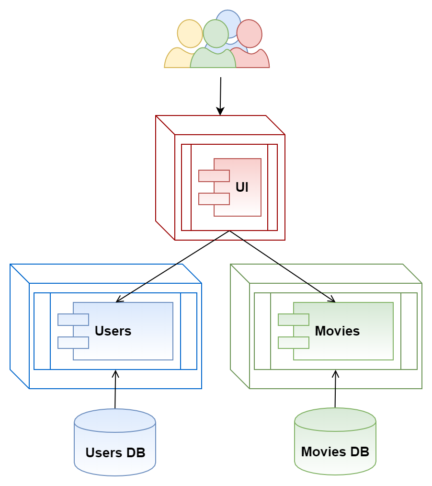

[_Torna al documento precedente/Back_](..)

# Introduzione/_Intro_
Questa sezione del repository contiene un esercizio legato alla creazione di un sistema per la gestione di un cinema utilizzando l'architettura a microservizi.

**Credits**: [https://github.com/mjhea0/microservice-movies](https://github.com/mjhea0/microservice-movies)

_This section of the repository contains an exercise mimicking the creation of a cinema management system using microservices architecture._

# Descrizione/_Description_
L'esercizio si articola nella realizzazione di 3 servizi:

1.  Servizio di gestione degli utenti, che consente la registrazione di utenti nel sistema e la loro successiva autenticazione.
    Il servizio è dotato di un suo database relazionale (PostgreSQL).
2.  Servizio di gestione dei film da vedere.
    Il servizio è dotato di proprio  database (PostgreSQL).
3.  Servizio che mette a disposizione un'interfaccia web per consultare l'applicazione.

_The exercise is built around 3 services:_
1.  _User service, which handles user registration and authentication in the system. It has its own database._
2.  _Movies service. It has its own database._
3.  _UI service._



## Specifiche seguite per l'implementazione/_Exercise's Specifications_
### Servizio di gestione degli utenti/_Users service_
_Ambiente di sviluppo/Development environment: <http://localhost:3000>_

| Endpoint        | HTTP Method | Output                                          |
| --------------- | ----------- | ----------------------------------------------- |
| /users/ping     | GET         | `pong`                                          |
| /users/register | POST        | aggiunta di un utente/_add a user_              |
| /users/login    | POST        | autenticazione dell'utente/_log in a user_      |
| /users/user     | GET         | riceve informazioni sull'utente/_get user info_ |

### Servizio di gestione dei film/_Movies service_
_Ambiente di sviluppo/Development environment: <http://localhost:3001>_

| Endpoint     | HTTP Method | Output                                                         |
| ------------ | ----------- | -------------------------------------------------------------- |
| /movies/ping | GET         | `pong`                                                         |
| /movies/user | GET         | riceve tutti i film visti dall'utente/_get all movies by user_ |
| /movies      | POST        | aggiunge l'utente al film/_add user to movie list_             |

### Servizio UI/_UI service_
_Ambiente di sviluppo/Development environment: <http://localhost:3007>_

| Endpoint    | HTTP Method | Result               |
| ----------- | ----------- | -------------------- |
| /           | GET         | _Home page_          |
| /login      | GET         | _Login form_         |
| /register   | GET         | _Registration Form_  |
| /logout     | GET         | _Logout_             |
| /collection | GET         | _User's movies page_ |

## Comandi/_Commands_
**É richiesta un'installazione di Docker.**
_**Docker must be installed.**_

-   Avviare i container/_Start the containers_:
    ```sh
    $ docker-compose up -d
    ```
-   Fermare i container/_Stop the containers_:
    ```sh
    $ docker-compose stop
    ```
-   Forzare un rebuild delle macchine/_Force images rebuild_:
    ```sh
    $ docker-compose build --no-cache
    ```
-   Cancellare i container e le immagini Docker/_Remove containers and Docker images_:
    ```sh
    $ docker-compose down
    ```
